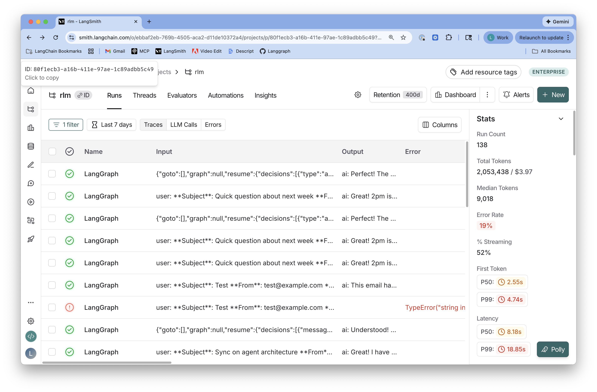
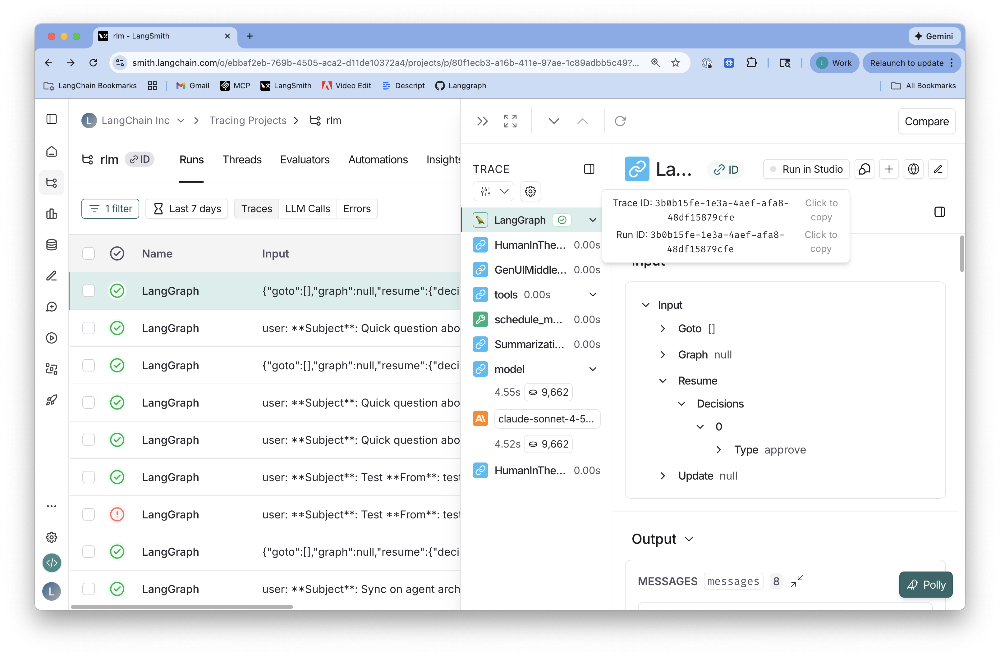
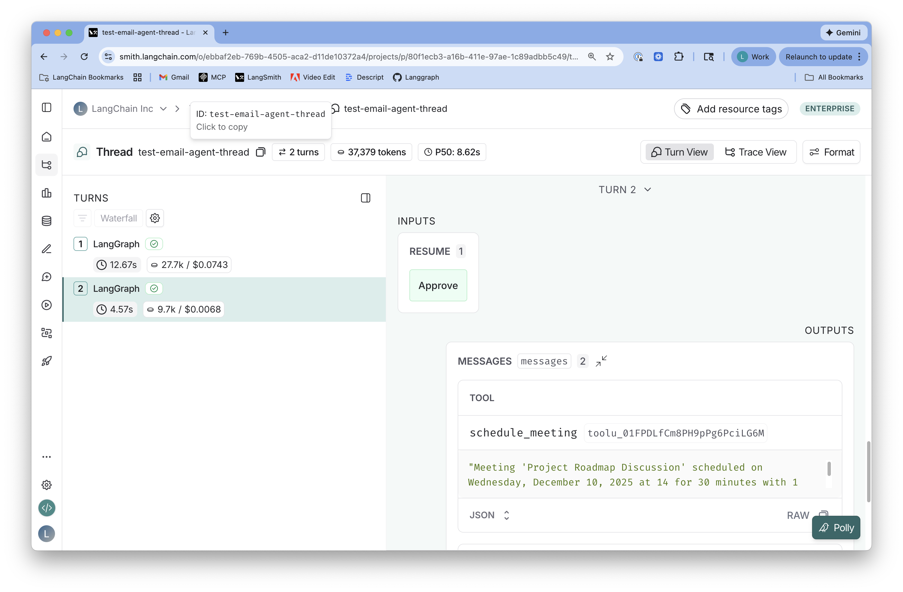

# LangSmith Fetch

CLI for fetching and displaying LangSmith data with LLM friendly formatting:

- Fetch recent threads from a project and save to files
- Fetch LangGraph thread messages by thread_id
- Fetch individual trace messages by trace ID
- Multiple output formats: raw JSON, pretty JSON, or human-readable
- Config file support for storing project UUID and preferences


## 🚀 Quickstart

### Installation

```bash
pip install langsmith-fetch
```

### Setup

Set your LangSmith API key:

```bash
export LANGSMITH_API_KEY=lsv2_...
```

Get your LangSmith project UUID (not name - UUID)

## Usage with a coding agent

Start your favorite coding agent.

Ask it:

**Use langsmith-fetch to analyze the last 3 threads from project <project-uuid> for potential improvements**

## Direct Usage

Set your project UUID (recommended for most workflows):

```bash
langsmith-fetch config set project-uuid <your-project-uuid>
```

**Fetch recent threads to a directory (RECOMMENDED):**

```bash
# Fetch 10 most recent threads to ./my-threads directory
langsmith-fetch threads ./my-threads --limit 10
```

**Fetch recent traces to a directory (RECOMMENDED):**

```bash
# Fetch 10 most recent traces to ./my-traces directory
langsmith-fetch traces ./my-traces --limit 10
```

**Fetch specific items by ID:**

```bash
# Fetch a specific trace by ID
langsmith-fetch trace 3b0b15fe-1e3a-4aef-afa8-48df15879cfe

# Fetch a specific thread by ID
langsmith-fetch thread test-email-agent-thread
```

> **Note:** When using `traces` or `threads` commands, always specify an output directory unless you explicitly want stdout output. Directory mode is the recommended default for typical workflows.

### Output Formats

LangSmith Fetch supports three output formats for different use cases:

- **`pretty`**: Human-readable Rich panels with color and formatting (default)
  - Best for: Terminal viewing, debugging, manual inspection
  - Example: `langsmith-fetch trace <id>` or `langsmith-fetch trace <id> --format pretty`

- **`json`**: Pretty-printed JSON with syntax highlighting
  - Best for: Reading structured data, copying to other tools
  - Example: `langsmith-fetch trace <id> --format json`

- **`raw`**: Compact single-line JSON for piping
  - Best for: Shell pipelines, automated processing, scripts
  - Example: `langsmith-fetch trace <id> --format raw | jq '.[] | select(.role=="user")'`

### Save to File

Single item commands (`trace` and `thread`) support saving output to a file:

```bash
# Save trace to JSON file
langsmith-fetch trace <trace-id> --file output.json --format json

# Save thread to text file
langsmith-fetch thread <thread-id> --file output.txt --format pretty
```

For bulk fetching (`traces` and `threads`), use directory mode instead:

```bash
# RECOMMENDED: Save multiple traces to directory (one file per trace)
langsmith-fetch traces ./my-traces --limit 10

# RECOMMENDED: Save multiple threads to directory (one file per thread)
langsmith-fetch threads ./my-threads --limit 10
```

## Features

### Understanding LangSmith Data Organization

LangSmith organizes data into three levels:
- **Runs**: Individual LLM calls or tool executions
- **Traces**: A collection of runs representing a single execution path (one trace contains multiple runs)
- **Threads**: A collection of traces representing a conversation or session (one thread contains multiple traces)

Learn more in the [LangSmith threads documentation](https://docs.langchain.com/langsmith/threads).

### Command Overview

| Command | What it fetches | Output |
|---------|----------------|--------|
| `trace <id>` | Specific **trace** by ID | stdout or file |
| `thread <id>` | Specific **thread** by ID | stdout or file |
| `traces <dir>` | Recent **traces** (bulk) | Multiple JSON files in directory (RECOMMENDED) |
| `threads <dir>` | Recent **threads** (bulk) | Multiple JSON files in directory (RECOMMENDED) |

**When to use each:**
- **`traces <dir>`** - "Fetch recent traces to directory" (RECOMMENDED: use directory mode by default)
- **`threads <dir>`** - "Fetch recent threads to directory" (RECOMMENDED: use directory mode by default)
- **`trace <id>`** - "I have a specific trace ID from the UI"
- **`thread <id>`** - "I have a specific thread ID and want all its messages"

**Important:** For `traces` and `threads` commands, always specify an output directory unless you explicitly need stdout output.

### Where to find each ID

You can find each ID in the LangSmith UI as shown in the screenshots below:

**Project ID:**


**Trace ID:**


**Thread ID:**


Alternatively, you can get the project UUID programmatically:

```python
from langsmith import Client

client = Client()

# Option 1: Get UUID from any trace in the project
run = client.read_run('<any-trace-id>')
print(run.session_id)  # This is your project UUID

# Option 2: Search for project by name
projects = list(client.list_projects())
for p in projects:
    if 'your-project-name' in p.name.lower():
        print(f'Project: {p.name}')
        print(f'UUID: {p.id}')
```

## Configuration

Add your project UUID and API key to the config file:

```bash
# Set project UUID (required for threads, optional but recommended for traces)
langsmith-fetch config set project-uuid <your-project-uuid>

# Set API key (optional, uses LANGSMITH_API_KEY env var by default)
langsmith-fetch config set api-key lsv2_...

# View your configuration
langsmith-fetch config show
```

Config file location: `~/.langsmith-cli/config.yaml`

## Usage

### Fetch Recent Threads

**RECOMMENDED: Use directory mode to save each thread to a separate JSON file:**

```bash
# Fetch 10 most recent threads to ./my-threads directory
langsmith-fetch threads ./my-threads --limit 10

# Fetch 25 most recent threads
langsmith-fetch threads ./my-threads --limit 25

# Override project UUID
langsmith-fetch threads ./my-threads --project-uuid <uuid>

# Customize filename pattern
langsmith-fetch threads ./my-threads --filename-pattern "thread_{index:03d}.json"
# Creates: thread_001.json, thread_002.json, etc.
```

**File Naming:**
- Default: Files named by thread ID (e.g., `abc123def.json`)
- Custom pattern: Use `--filename-pattern` with placeholders:
  - `{thread_id}` - Thread ID (default: `{thread_id}.json`)
  - `{index}` or `{idx}` - Sequential number starting from 1
  - Format specs supported: `{index:03d}` for zero-padded numbers

**Stdout mode (only if you explicitly need it):**

```bash
# Fetch latest thread to stdout
langsmith-fetch threads --format json

# Fetch 5 latest threads to stdout
langsmith-fetch threads --limit 5 --format json
```

### Fetch Thread by LangGraph thread_id

```bash
# With config file (project UUID already set)
langsmith-fetch thread test-email-agent-thread

# Override project UUID
langsmith-fetch thread test-email-agent-thread --project-uuid <uuid>

# Specify output format
langsmith-fetch thread test-email-agent-thread --format json
langsmith-fetch thread test-email-agent-thread --format pretty
langsmith-fetch thread test-email-agent-thread --format raw

# Save to file
langsmith-fetch thread test-email-agent-thread --file output.json --format json
```

### Fetch Trace by UUID

```bash
# Fetch single trace
langsmith-fetch trace 3b0b15fe-1e3a-4aef-afa8-48df15879cfe

# With format option
langsmith-fetch trace 3b0b15fe-1e3a-4aef-afa8-48df15879cfe --format json

# Save to file
langsmith-fetch trace 3b0b15fe-1e3a-4aef-afa8-48df15879cfe --file trace.json --format json
```

### Fetch Recent Traces

Perfect for the workflow: "I just did a thing and I want the CLI to just grab the trace(s)."

The `traces` command has two modes:

**DIRECTORY MODE (RECOMMENDED) - Save each trace to a separate JSON file:**

```bash
# Fetch 10 traces to ./my-traces directory
langsmith-fetch traces ./my-traces --limit 10

# Fetch 25 traces with sequential numbering
langsmith-fetch traces ./my-traces --limit 25 --filename-pattern "trace_{index:03d}.json"

# Fetch traces from last hour
langsmith-fetch traces ./my-traces --limit 20 --last-n-minutes 60

# Fetch traces since a specific time
langsmith-fetch traces ./my-traces --limit 10 --since 2025-12-09T10:00:00Z
```

**File Naming (directory mode):**
- Default: Files named by trace ID (e.g., `3b0b15fe-1e3a-4aef-afa8-48df15879cfe.json`)
- Custom pattern: Use `--filename-pattern` with placeholders:
  - `{trace_id}` - Trace ID (default: `{trace_id}.json`)
  - `{index}` or `{idx}` - Sequential number starting from 1
  - Format specs supported: `{index:03d}` for zero-padded numbers

**STDOUT MODE (only if you explicitly need it):**
Fetch traces and print to stdout or save to a single file.

```bash
# Fetch most recent trace (default: 1 trace, pretty format)
langsmith-fetch traces

# Fetch most recent trace from a specific project
langsmith-fetch traces --project-uuid 80f1ecb3-a16b-411e-97ae-1c89adbb5c49

# Fetch most recent trace from last 30 minutes
langsmith-fetch traces --last-n-minutes 30

# Fetch 5 most recent traces to stdout
langsmith-fetch traces --limit 5 --format json

# Save to single file
langsmith-fetch traces --file latest.json --format raw
```

**Notes:**
- While project UUID is optional, providing it (via config or `--project-uuid`) filters results to a specific project, making searches faster and more targeted.
- Traces are fetched by chronological time (most recent first)
- **Always use directory mode unless you explicitly need stdout output**

## Examples

### Basic Thread Fetch

```bash
$ langsmith-fetch thread test-email-agent-thread

╭─────────────────────────── Message 1: USER ───────────────────────────╮
│ Subject: Quick question about next week                               │
│ From: jane@example.com                                                │
│ To: lance@langchain.dev                                               │
│                                                                        │
│ Hi Lance,                                                             │
│ Can we meet next Tuesday at 2pm to discuss the project roadmap?      │
╰────────────────────────────────────────────────────────────────────────╯

╭────────────────────────── Message 2: ASSISTANT ───────────────────────╮
│ Tool: triage_email                                                    │
│ ...                                                                   │
╰────────────────────────────────────────────────────────────────────────╯
```

### JSON Output

```bash
$ langsmith-fetch trace 3b0b15fe-1e3a-4aef-afa8-48df15879cfe --format json

[
  {
    "role": "user",
    "content": "..."
  },
  ...
]
```

## Tests

Run the test suite:

```bash
# Install with test dependencies
pip install -e ".[test]"

# Or with uv
uv sync --extra test

# Run all tests
pytest tests/

# Run with verbose output
pytest tests/ -v

# Run with coverage
pytest tests/ --cov=langsmith_cli
```

The test suite includes 50 tests covering:
- All CLI commands (traces, trace, thread, threads, config)
- All output formats (pretty, json, raw)
- Config management and storage
- API fetching and error handling
- Time filtering and SDK integration
- Edge cases and validation

## License

MIT
